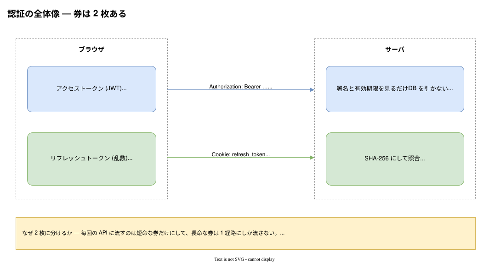
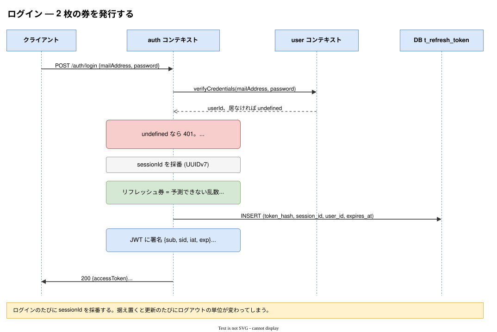
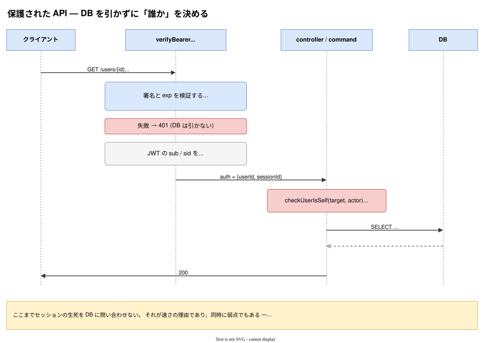
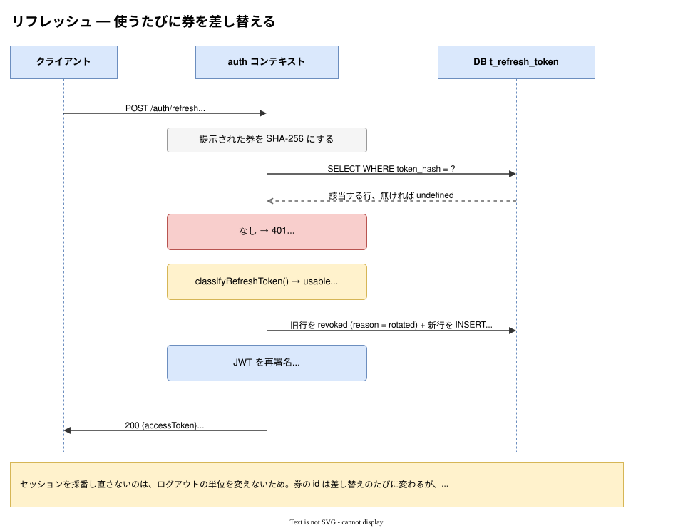
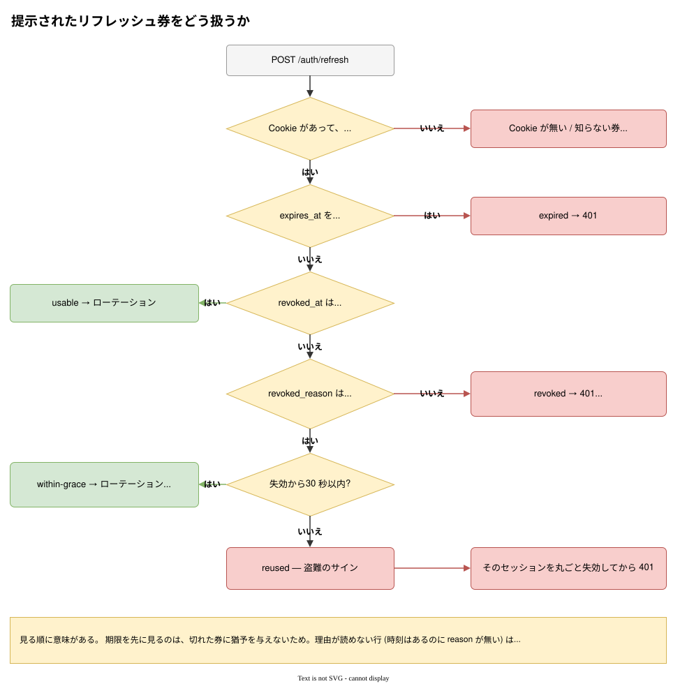

# 認証

このプロダクトが「誰からのリクエストか」をどう決めているか。図は
[`auth-flow.drawio`](auth-flow.drawio) が正で、SVG はそこからの書き出し。

| 読むもの                                                       | いつ                                                          |
| -------------------------------------------------------------- | ------------------------------------------------------------- |
| **[通しのフロー](通しのフロー.md)**                            | **作成 → ログアウトを一周見たいとき。フロント側の実装もここ** |
| このページ                                                     | 個々の仕組みと、そう決めた理由                                |
| [小話: なぜ 1 時間なのか](小話-アクセストークン.md)            | 「なぜ 1 時間?」「Bearer って何?」が引っかかったとき          |
| [小話: フロントで券をどこに置くか](小話-フロントの状態管理.md) | フロントを書くとき。zustand と TanStack Query の使い分け      |

---

## 1. JWT とは何か

### 3 つの部品

`header.payload.signature` を `.` で連結しただけの 1 本の文字列。各部は base64url。
うちが実際に発行している券を割るとこうなっている。

```jsonc
// header — どの方式で署名したか
{ "alg": "HS256", "typ": "JWT" }

// payload — 誰が (sub) / どのログインで (sid) / いつ発行 (iat) / いつまで (exp)
{ "sub": "019f…", "sid": "019f…", "iat": 1755300000, "exp": 1755300900 }

// signature (秘密鍵を知っている人にしか計算できないハッシュ値)
HMAC-SHA256("<header>.<payload>", 秘密鍵)
```

### 一番よく誤解されるところ

**base64url は暗号ではない。** payload は誰でもデコードして読める。
署名が守るのは「**改ざんされていないこと**」であって「**中身が秘密であること**」ではない。

だから payload に入れてよいのは、漏れても困らないものだけ。うちが載せているのは
id が 2 つと時刻が 2 つで、名前もメールアドレスも入れていない。

### なぜサーバが DB を引かずに済むか

秘密鍵を持っているのはサーバだけなので、**署名が合う = 自分が発行した券**と分かる。
`exp` も payload の一部＝署名の対象なので、期限を書き換えれば署名が合わなくなる。

結果、「誰か」を決めるのに要るのは HMAC の計算 1 回だけ。DB 往復はゼロ。

### 引き換えに失うもの

**発行済みの券は取り消せない。** サーバは券を覚えていないので、「これは無効」と
言う先が無い。これが JWT の唯一にして最大の弱点で、うちを含むほとんどの設計は
これを「**寿命を短くして我慢する**」で処理している。

うちは 1 時間。そして、1 時間ごとに再ログインさせないために 2 枚目の券が要る。

> なぜ 1 時間なのか（24 時間を見送った理由も）、`Bearer` が何を意味するのかは
> [小話: なぜ 1 時間なのか — Bearer は「持参人」](小話-アクセストークン.md) に分けた。

---

## 2. 券は 2 枚ある



|              | アクセストークン         | リフレッシュトークン                    |
| ------------ | ------------------------ | --------------------------------------- |
| 形式         | JWT (HS256)              | 32 バイトの乱数 (`rt_` 始まり)          |
| 中身         | 意味がある (id が読める) | **意味が無い** (ただの文字列)           |
| 寿命         | 1 時間                   | 2 日（使うたびに延びる）                |
| 渡し方       | `Authorization: Bearer`  | Cookie (`HttpOnly`, `SameSite=Lax`)     |
| 送る経路     | すべての保護 API         | **`POST /auth/refresh` だけ**           |
| サーバの保存 | しない                   | **SHA-256 だけ** (券そのものは持たない) |
| 検証         | 署名と `exp`             | ハッシュで引いて行の状態を見る          |
| 取り消し     | **できない**             | できる (行を失効させる)                 |

**この非対称がすべて。** 短命で取り消せない券を毎回使い、長命で取り消せる券は
1 経路にしか流さない。片方が漏れたときの被害を、寿命か経路のどちらかで抑えている。

---

## 3. フロー

### 3-1. ログイン



### 3-2. 保護された API へのアクセス



### 3-3. リフレッシュ



### 3-4. 提示された券をどう扱うか（盗難検出）



**`POST /auth/refresh` が失敗したときの応答は 1 種類しかない。**
Cookie が無くても、短すぎても、でたらめでも、期限切れでも、失効済みでも
すべて同じ `401`・同じ本文になる。呼ぶ側にとってはどれも「認証をやり直せ」でしかなく、
`400` と `401` に割れると再ログインの判定を 2 通り書くことになるため
（契約の `@cookie refreshToken?` が任意なのはこのため）。

盗まれた券が使われると、**本人と攻撃者のどちらかが必ず「一度使われた券」を出す**。
それが検出の原理。行を消さずに `revoked_at` で残しているのはこのためで、消すと
「盗難のサイン」と「知らない券」の区別がつかなくなる。

---

## 4. 何を防いでいるか

| 攻撃                                | 対策                                                                                                          | どこ                                           |
| ----------------------------------- | ------------------------------------------------------------------------------------------------------------- | ---------------------------------------------- |
| `alg:none` や空署名の偽券           | 検証時にアルゴリズムを **HS256 に固定**                                                                       | `shared/infrastructure/access-token-issuer.ts` |
| 鍵の総当たり                        | 起動時に 32 文字未満の秘密鍵を拒否                                                                            | 同上                                           |
| XSS でリフレッシュ券を盗む          | `HttpOnly` (JS から読めない)                                                                                  | `auth/presentation/refresh-cookie.ts`          |
| 通り道すべてが漏洩点になる          | `Path=/auth/refresh` で送る経路を 1 つに絞る                                                                  | 同上                                           |
| CSRF                                | 保護 API は Bearer なのでブラウザが自動で付けない。<br>Cookie を使う `/auth/refresh` は `SameSite=Lax` + POST | 同上                                           |
| DB が漏れてリフレッシュ券が使われる | 保存するのは **SHA-256 だけ**                                                                                 | `auth/infrastructure/refresh-token-issuer.ts`  |
| 盗んだリフレッシュ券の使い回し      | 毎回ローテーション + 猶予外の再利用でセッション失効                                                           | `auth/domain/model/refresh-token.ts`           |
| アカウントの存在を探る              | 401 の本文を書き分けない (「居ない」と「合わない」を畳む)                                                     | `user/domain/services/verify-credentials.ts`   |
| 他人の id を指定する                | `checkUserIsSelf` → 403                                                                                       | `user/domain/services/check-user-is-self.ts`   |
| パスワード変更後も盗んだ側が残る    | 本人の端末を除いて全セッション失効                                                                            | `user/application/change-password-command.ts`  |
| 退会後も更新し続けられる            | 全セッション失効 (**FK が無いので DB は掃除しない**)                                                          | `user/application/delete-user-command.ts`      |

最後の 2 つは、**コードを読んでではなく実 DB に叩いて見つけた**もの。
どちらも「消えたはずの利用者の券が生き続ける」形で残っていた。

---

## 5. コードの地図

| 何                                | どこ                                                                                    |
| --------------------------------- | --------------------------------------------------------------------------------------- |
| 契約 (先に決まる)                 | `schema/src/**/*.tsp` → `schema/dist/openapi.yaml` → `src/generated/` (gitignore 済み)  |
| **JWT の語彙を話す唯一の場所**    | `shared/infrastructure/access-token-issuer.ts`                                          |
| ポート (アプリの語彙)             | `shared/domain/access-token-issuer.ts`<br>`shared/domain/model/authenticated-caller.ts` |
| Bearer の取り出しと検証           | `shared/presentation/handler/verify-bearer.ts`                                          |
| 券の業務ルール (寿命・猶予・状態) | `auth/domain/model/refresh-token.ts`                                                    |
| 乱数生成とハッシュ                | `auth/infrastructure/refresh-token-issuer.ts`                                           |
| ユースケース                      | `auth/application/{login,refresh,logout}-command.ts`                                    |
| Cookie の属性 (**唯一の場所**)    | `auth/presentation/refresh-cookie.ts`                                                   |
| user コンテキストへの口           | `auth/public/session-revoker.ts`                                                        |

`sub` / `sid` / `claims` という JWT の言葉が出てよいのは
`access-token-issuer.ts` の中だけ。そこから内側へは
`AuthenticatedCaller { userId, sessionId }` に直して渡す。
**プロトコルの都合をドメインに持ち込まないため。**

---

## 6. 分かっている割り切り

1. **ログアウトしても、発行済みのアクセス券は最大 1 時間そのまま通る。**
   ステートレスの代償そのもの。毎回 DB を引けば消せるが、それは JWT を使う理由を捨てること。
2. **`t_refresh_token.user_id` に FK を張っていない。** 意図的だが、その分
   「退会したら券も切る」をアプリ側で守る責任が残る。
3. **秘密鍵に `kid` が無い。** 鍵を替えると発行済みのアクセス券は全部無効になるが、
   リフレッシュ券は DB 側なので生き残る — クライアントが 401 でリフレッシュする作りなら
   再ログインは要らない。
4. **猶予 30 秒は誤検出と検出漏れのつまみ。** 短くすると同時更新したタブを盗難として
   切ってしまい、長くすると盗んだ側に猶予を与える。

5. **CORS ミドルウェアが無い。** `src/app.ts` に入っているのは `resolveRequestId` の 1 枚だけ。
   別オリジンの SPA からは 1 本も通らない (詳細は [通しのフロー](通しのフロー.md))。

---

## 関連

- [通しのフロー](通しのフロー.md) — 作成からログアウトまでの一周と、フロント側の実装・CORS
- [小話: なぜ 1 時間なのか](小話-アクセストークン.md) — 寿命の相場、24 時間を見送った理由、`Bearer` の意味
- [小話: フロントで券をどこに置くか](小話-フロントの状態管理.md) — 券の置き場、3 状態のログイン判定、永続化の罠

---

## 参考

- [JWT（JSON Web Token）についてまとめる](https://zenn.dev/kipcop/articles/3e3b95ddbdbb2f) —
  この文書の 1 章に相当する範囲。**うちはその先**（リフレッシュ・ローテーション・失効）を持つ。
- [RFC 7519 JSON Web Token](https://datatracker.ietf.org/doc/html/rfc7519) — `sub` / `iat` / `exp` の出典
- [OAuth 2.0 Security BCP](https://datatracker.ietf.org/doc/html/draft-ietf-oauth-security-topics) —
  リフレッシュトークンのローテーションと再利用検出の根拠
