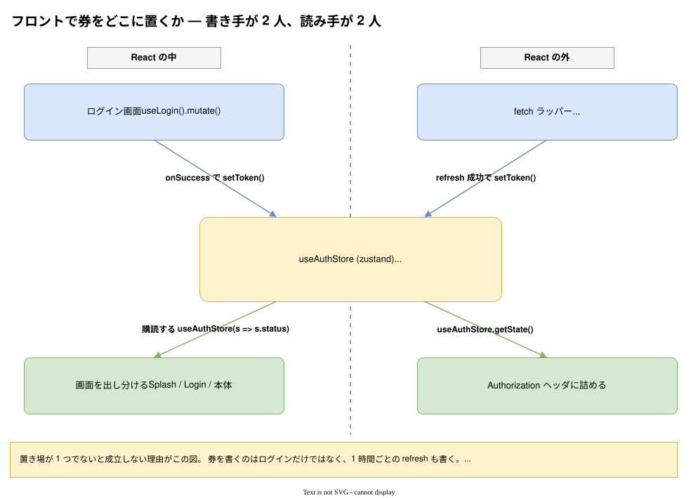
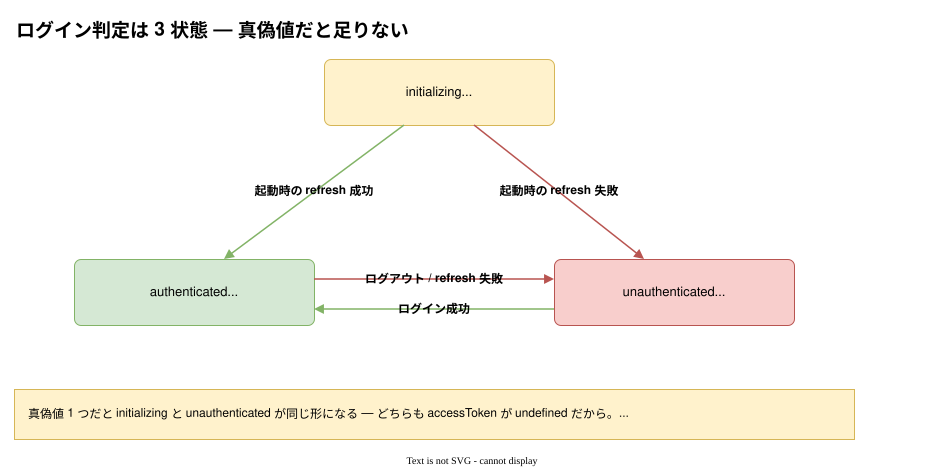

# 小話: フロントで券をどこに置くか

ログイン API が返す `{ accessToken }` の置き場と、ログイン判定の作り方。
[通しのフロー](通しのフロー.md) の④をフロント側から掘り下げたもの。

> **注意。** このリポジトリにフロントエンドは無い。API の形から導かれる
> **設計上の要求**をまとめたもので、コードはすべて雛形。

---

## 結論から

| 置くもの                 | 置き場                                    |
| ------------------------ | ----------------------------------------- |
| `accessToken`            | **zustand の store**（or モジュール変数） |
| ログイン判定             | 同じ store の **3 状態の `status`**       |
| ログインしている人の情報 | `useQuery(['me'])`                        |
| リフレッシュトークン     | **触らない**（HttpOnly Cookie）           |

---

## なぜ「1 箇所」でないと成立しないか



**書き手が 2 人いる。** ログインだけでなく、1 時間ごとの refresh も券を書く。
**読み手も 2 人いる。** 画面（React の中）と fetch ラッパー（React の外）。

この 4 者すべてに届く場所でなければならない。それが置き場を選ぶ唯一の条件。

---

## ボツ案: TanStack Query の mutation の返り値を参照する

「ログインは `useMutation` で叩くのだから、その `data` を見ればいい」——
自然な発想だが、2 つの理由で壊れる。どちらも `@tanstack/query-core` で実測した。

### ① `data` はコンポーネントごとに独立している

`useMutation` は**呼んだコンポーネントごとに observer を 1 個作る**。
同じ `mutationKey` でも状態は共有されない。

```text
ログイン画面 の data : { accessToken: "eyJ…ログインで得た券" }
ユーザー一覧 の data : undefined      ← 同じ mutationKey なのに
```

再マウントも同じ。新しい observer は必ず `undefined` から始まるので、
**ログイン画面を離れた時点で参照元が消える。**

### ② 券を書くのはログインだけではない

これがより深い理由。1 時間後、fetch ラッパーの中で走る refresh が新しい券を返すが、
それは**別の mutation**。login の `data` は古い券を持ったまま固まる。

```text
refresh の data : { accessToken: "eyJ…refresh で得た新しい券" }
login   の data : { accessToken: "eyJ…ログインで得た券" }   ← 更新されない
```

時系列で見ると、一致するのは最初の一瞬だけ。

| 時刻 | 起きること         | `login` の `data` | 実際に必要な券 |
| ---- | ------------------ | ----------------- | -------------- |
| 0:00 | ログイン           | `A`               | `A` ✅         |
| 0:01 | 別画面へ遷移       | 参照元が消える    | `A` ❌         |
| 1:00 | 期限切れ → refresh | `A` のまま        | `B` ❌         |
| 2:00 | 再度 refresh       | `A` のまま        | `C` ❌         |

**mutation の返り値は「その 1 回の呼び出しの記録」であって、「いま有効な券」ではない。**

> ①だけなら `useMutationState({ filters: { mutationKey: ['login'] } })` で
> グローバルに読めるので回避できる。だが②は解決しない。

そして実務上の詰みがもう 1 つ。**ヘッダに詰めるのは fetch ラッパーの中＝React の外**なので、
そもそもフックを呼べない。

---

## 補足: モジュール変数は「1 ファイル限定」ではない

「変数だと 1 ファイルからしか見えないのでは」と思いがちだが、**ES モジュールは
シングルトン**なので、import した全員が同じ変数を見る。

```ts
// token.ts — 3 ファイルが import しても、評価されるのは 1 回だけ
let accessToken: string | undefined;
export const setToken = (t: string) => {
  accessToken = t;
};
export const getToken = () => accessToken;
```

```text
login-form.tsx で setToken() した値が
  user-list.tsx からも api-client.ts からも見える
```

CommonJS の `require` キャッシュと同じ仕組み。

**つまり zustand が足すのは「グローバルさ」ではない。** zustand の中身も
「モジュール変数 + 購読の仕組み」で、足しているのは**再描画**のほう。

それでも zustand を選ぶ理由は 1 つ。**React の内と外の両方から扱えるから。**

```ts
useAuthStore.getState().accessToken; // React の外（fetch ラッパー）
useAuthStore((s) => s.status); // React の中（購読して再描画）
```

素の変数だと前者しかできず、TanStack Query だと後者しかできない。

---

## ログイン判定は真偽値だと足りない



`accessToken` の有無で判定すると、**区別できない状態が 2 つ**できる。

| 状態                             | `accessToken` | 有無で判定できるか |
| -------------------------------- | ------------- | ------------------ |
| 起動直後（refresh を試している） | `undefined`   | ❌                 |
| ログイン済み                     | あり          | ✅                 |
| 未ログイン                       | `undefined`   | ❌                 |

1 行目を「未ログイン」と判定すると、**リロードのたびにログイン画面が一瞬映る**。
まだ復帰中なのに。

`status` は `accessToken` の重複ではない。**券だけでは表せない情報
（まだ確かめていない）を運んでいる**ので、別に持つ価値がある。

---

## 完成形

```ts
// auth/store.ts
import { create } from "zustand";

type AuthStatus = "initializing" | "authenticated" | "unauthenticated";

type AuthState = {
  readonly accessToken: string | undefined;
  readonly status: AuthStatus;
  readonly setToken: (accessToken: string) => void;
  readonly clear: () => void;
};

export const useAuthStore = create<AuthState>()((set) => ({
  accessToken: undefined,
  status: "initializing", // 起動直後は「まだ分からない」
  setToken: (accessToken) => set({ accessToken, status: "authenticated" }),
  clear: () => set({ accessToken: undefined, status: "unauthenticated" }),
}));
```

```ts
// ① ログイン成功（mutation の onSuccess）
const useLogin = () =>
  useMutation({
    mutationFn: (body: { mailAddress: string; password: string }) =>
      api.post("/auth/login", body),
    onSuccess: (data) => useAuthStore.getState().setToken(data.accessToken),
  });

// ② リフレッシュ成功（fetch ラッパーの中。React の外）
useAuthStore.getState().setToken(newAccessToken);

// ③ ヘッダに詰める（同じくラッパーの中）
const { accessToken } = useAuthStore.getState();

// ④ 画面での分岐
const status = useAuthStore((s) => s.status);
if (status === "initializing") return <Splash />;
if (status === "unauthenticated") return <Login />;

// ⑤ ログアウト
useAuthStore.getState().clear();
queryClient.clear(); // 前の利用者のキャッシュを消す
```

**①と②が同じ `setToken` を呼べる**ことが要点。書き手が 2 人いても置き場は 1 つ。

### 起動時に 1 回

```ts
// アプリを mount する前、またはルート直下で 1 回だけ
const ok = await refresh();
if (!ok) useAuthStore.getState().clear(); // initializing → unauthenticated
```

成功すれば `setToken` が呼ばれて `authenticated` になる。
これを `useQuery` でやると、**復帰が終わる前に他のクエリが走って軒並み 401 になる**。
ラッパーがリトライするので最終的には動くが、起動のたびに無駄な 401 が並ぶ。

---

## やってはいけないこと

### 券を永続化する

```ts
// ❌ localStorage に書かれる
create(persist((set) => ({ accessToken: "…" }), { name: "auth" }));
```

zustand の `persist` も TanStack Query の `persistQueryClient` も **localStorage に書く**。
リフレッシュトークンを `HttpOnly` にしている意味が消える。

**しかも足した本人に自覚がない**のが厄介なところ。「一覧のキャッシュを残したかっただけ」
「リロードでチラつくのを直したかっただけ」で入り、券が巻き添えで保存される。

既存の store に相乗りするなら `partialize` で `accessToken` を必ず除外する。

### ログアウトでキャッシュを残す

```ts
useAuthStore.getState().clear();
// queryClient.clear() を忘れると…
```

券だけ捨ててキャッシュを残すと、**別アカウントでログインした直後に
前の利用者の情報が一瞬見える**。

---

## 関連

- [通しのフロー](通しのフロー.md) — 作成からログアウトまでの一周、401 リトライの雛形、CORS
- [小話: なぜ 1 時間なのか](小話-アクセストークン.md) — 寿命の相場、`Bearer` の意味
- [README](README.md) — サーバ側の仕組みと、そう決めた理由
